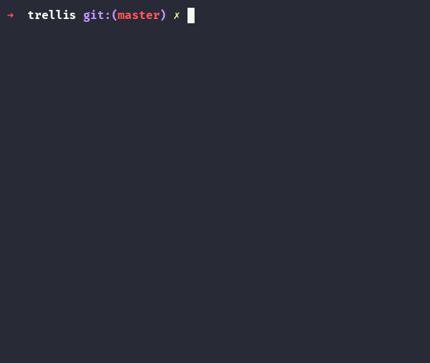

# trellis

(c) 1988 &mdash; Gatlin Cheyenne Johnson <gatlin@niltag.net>



# What?

A console-based spreadsheet application written in Haskell.

# How to build.

Install [GHCup](https://www.haskell.org/ghcup/), the Haskell toolchain
installer, then GHC itself:

```
curl --proto '=https' --tlsv1.2 -sSf https://get-ghcup.haskell.org | sh
ghcup install ghc 9.12.2
```

Accept the defaults it offers, and restart your terminal once it's done.

If you cloned this repo fresh, use `git clone --recurse-submodules`
instead. Already have it? Just run:

```
git submodule update --init
```

Then, from inside the repo:

```
cabal build
cabal run trellis
```

Run it in a real terminal (not an IDE's built-in one) with mouse
support and 256 colors.

# Current features.

* Comonadic sheet evaluation. `evaluate` ties a lazy self-referential
  knot over the grid rather than building a dependency graph.
* A small typed formula language: numbers, strings, booleans, explicit
  conversion only (`STR`, `NUM`), no implicit coercion between them.
* Six builtins: `IF`, `AND`, `OR`, `NOT`, `STR`, `NUM`.
* Mouse support: click to select or drag, double-click to edit, scroll
  to zoom, middle-click-drag to pan.
* Keyboard navigation and a modal formula editor with interior cursor
  movement.
* Configurable keybindings, read from a plain text config file at
  `~/.config/trellis/keybindings` (regenerated with defaults if missing).


